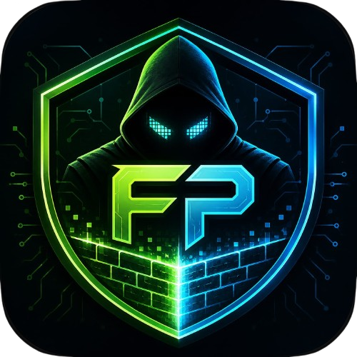

<p align="center">
  
</p>

<h1 align="center">Firewall Protocol</h1>

<p align="center">
  <strong>Thriller de deducción social multijugador</strong> con temática de ciberseguridad.<br/>
  5–16 jugadores · 44 roles · noche/día · votaciones · victoria en tiempo real.
</p>

<p align="center">
  <a href="#qué-es-el-juego">Qué es</a> ·
  <a href="#arquitectura">Arquitectura</a> ·
  <a href="#inicio-rápido">Inicio rápido</a> ·
  <a href="#documentación">Documentación</a> ·
  <a href="CHANGELOG.md">Cambios recientes</a>
</p>

---

## Qué es el juego

**Firewall Protocol** es un juego de mesa digital inspirado en *Mafia* / *Werewolf*, ambientado en un datacenter bajo ataque. Los jugadores son **nodos de una red**: defensores del Sistema, hackers Black Hat y agentes **caóticos** con victorias solitarias.

| Elemento | Descripción |
|----------|-------------|
| **Equipos** | **System** (defensa), **Black Hat** (ataque) y **Caótico** (agendas independientes) |
| **Ciclo** | **Noche** (acciones secretas en el móvil) → **Día** (debate e incidentes) → **Votación** (expulsar sospechosos) → **Verificación** |
| **Roles** | **44 roles** en catálogo (16 System · 14 Black Hat · 14 Caótico); en cada partida se reparten sin repetir hasta agotar el pool del bando |
| **Host** | Pantalla grande (PC/TV): topología, votos, logs SIEM — **sin revelar roles vivos** |
| **Jugadores** | Teléfono como terminal: rol, acciones, chat, votos; cuenta opcional para historial y avatar |
| **Cuentas** | Jugar como **invitado** o registrarse (correo); sesión persistente; perfil con estadísticas e historial |

La partida termina cuando un bando gana (System / Black Hat) o un rol **solitario** (Troll, Gusano, Minero, desempate caótico tardío, Zero-Day heredado, etc.). Ver [`WIN_CONDITIONS.md`](WIN_CONDITIONS.md) y [`ROLES.md`](ROLES.md).

### Balance por tamaño de mesa

| Parámetro | Regla |
|-----------|--------|
| Jugadores | 5–16 (`MIN_PLAYERS` / `MAX_PLAYERS`) |
| Black Hat | ~1 cada 4 jugadores (≤8) o cada 3 (9+) |
| Caóticos | ~1 cada 5 jugadores |
| Resto | System (Antivirus, SOC, Parcheador, etc.) |

Detalle en `backend-server/src/game/balance.ts`.

---

## Arquitectura

Monorepo: **tres clientes** + **un backend monolítico** (microservicios planificados, no desplegados). Ver [`docs/PROJECT_STATUS.md`](docs/PROJECT_STATUS.md).

```
┌─────────────────┐     Socket.io /game      ┌──────────────────────────┐
│  mobile-terminal │ ◄──────────────────────► │                          │
│  (Ionic/Angular) │                          │    backend-server        │
└─────────────────┘                          │    Node + Express        │
                                             │    Socket.io             │
┌─────────────────┐   Socket.io /dashboard   │                          │
│  web-dashboard  │ ◄──────────────────────► └───────────┬──────────────┘
│  (Angular)      │                                      │
└─────────────────┘                          ┌───────────┴──────────────┐
                                             │ MongoDB    MinIO (opt.) │
                                             │ partidas   avatares      │
                                             │ usuarios   JSON fallback │
                                             └──────────────────────────┘
```

| Carpeta | Rol | Audiencia |
|---------|-----|-----------|
| [`backend-server/`](backend-server/) | Motor de juego, auth, persistencia, bots QA | Servidor |
| [`mobile-terminal/`](mobile-terminal/) | Terminal del jugador: login, rol, acciones, cuenta | Teléfonos |
| [`web-dashboard/`](web-dashboard/) | Host/TV: QR, topología, SIEM, replay, bots | PC / proyector |

**Contrato de eventos:** [`SOCKET_CONTRACT.md`](SOCKET_CONTRACT.md)  
**Tipos canónicos:** [`backend-server/src/types/events.types.ts`](backend-server/src/types/events.types.ts)

---

## Inicio rápido

### Opción A — Docker (Mongo + MinIO + backend)

```bash
cd backend-server
docker compose up
```

Backend en `http://localhost:3000`, Mongo en `27017`, MinIO en `9000` (consola `9001`).

### Opción B — Local

```bash
cd backend-server
cp .env.example .env    # ajusta MONGO_URI, JWT_SECRET, AVATAR_STORAGE
npm install
npm run db:setup        # requiere Mongo
npm run dev
```

### Dashboard (host)

```bash
cd web-dashboard
npm install
ng serve
```

`http://localhost:4200` → crear sala → QR / código `FIRE-XXXX`.

### Terminal móvil (jugadores)

```bash
cd mobile-terminal
npm install
ionic serve
```

En LAN: configurar URL del backend en login (ngrok/LAN) o `environment.ts`. Build nativo: Capacitor (`ionic cap`).

### Prueba en red externa

Túnel (ngrok, etc.) hacia el puerto **3000**; en el móvil guarda la URL en la pantalla de login (`fp_apiUrl`).

---

## Flujo típico de una partida

1. **Host** crea sala en web-dashboard (5–16 jugadores).
2. **Jugadores** escanean QR o ingresan `FIRE-XXXX` en el móvil (invitado o con cuenta).
3. **Host** inicia → overlay *Distribuyendo roles* en TV; reparto automático sin repetir rol en el mismo bando.
4. **Móvil:** briefing de credencial (~20 s) + amenaza por equipo; botón *Ver rol y habilidad* durante la partida.
5. **Noche:** acciones secretas; minijuegos (skill checks) en algunos roles; TV muestra progreso.
6. **Día:** incidentes (bajas sin revelar atacante); debate en chat público.
7. **Votación:** expulsión por mayoría; posible victoria inmediata.
8. **Fin:** overlay narrativo en todos los dispositivos; replay JSON / `.log`; historial en cuenta si estabas logueado.

Bots QA y partida automática: [`TESTING.md`](TESTING.md).

---

## Documentación

**Índice del equipo:** [`docs/README.md`](docs/README.md) · [**Estado del proyecto**](docs/PROJECT_STATUS.md) · [Roadmap web](docs/ROADMAP_WEB_DASHBOARD.md) · [Roadmap móvil](docs/ROADMAP_MOBILE.md) · [Roadmap backend](docs/ROADMAP_BACKEND.md)

| Documento | Contenido |
|-----------|-----------|
| [`docs/PROJECT_STATUS.md`](docs/PROJECT_STATUS.md) | Qué cumple hoy (BD, clientes, monolito vs microservicios) |
| [`ROLES.md`](ROLES.md) | Catálogo de **44 roles**, habilidades y victorias |
| [`WIN_CONDITIONS.md`](WIN_CONDITIONS.md) | Condiciones de victoria y orden de evaluación |
| [`SOCKET_CONTRACT.md`](SOCKET_CONTRACT.md) | Eventos Socket.io (`/game` y `/dashboard`) |
| [`DATABASE.md`](DATABASE.md) | MongoDB, auth, colecciones, scripts `db:*` |
| [`STORAGE_AND_AVATARS.md`](STORAGE_AND_AVATARS.md) | Avatares MinIO / disco |
| [`TESTING.md`](TESTING.md) | QA manual y bots |
| [`CHANGELOG.md`](CHANGELOG.md) | Historial de cambios |
| README por app | [`backend-server/`](backend-server/README.md) · [`web-dashboard/`](web-dashboard/README.md) · [`mobile-terminal/`](mobile-terminal/README.md) |

---

## Stack tecnológico

| Capa | Tecnologías |
|------|-------------|
| Backend | TypeScript, Node.js, Express, Socket.io, MongoDB driver |
| Web dashboard | Angular 20, topología 2D/3D, Tailwind |
| Mobile terminal | Ionic, Angular, Capacitor, Socket.io-client |
| Datos | MongoDB (`MONGO_URI`), fallback JSON; **MinIO** avatares (`AVATAR_STORAGE=minio`) |
| Auth | JWT + refresh (90 d), cuentas, `game_participations` |

---

## Estado del proyecto

Proyecto de grado — **Programación Móvil**. El backend es la fuente de verdad; los clientes son vistas en tiempo real.

**Detalle:** [`docs/PROJECT_STATUS.md`](docs/PROJECT_STATUS.md)

**Funcional hoy:** 44 roles, fases completas, minijuegos, chat multicanal, victoria, reconexión, MongoDB, cuentas e historial, avatares MinIO, bots QA, persistencia y replay, sesión móvil larga.

**Arquitectura:** monolito + Mongo + MinIO; microservicios documentados para evolución futura.

---

## Licencia y créditos

Proyecto académico — *Firewall Protocol Master Document (GDD)*, ampliado a catálogo de 44 roles.  
Desarrollo colaborativo: backend, dashboard web y terminal móvil.
